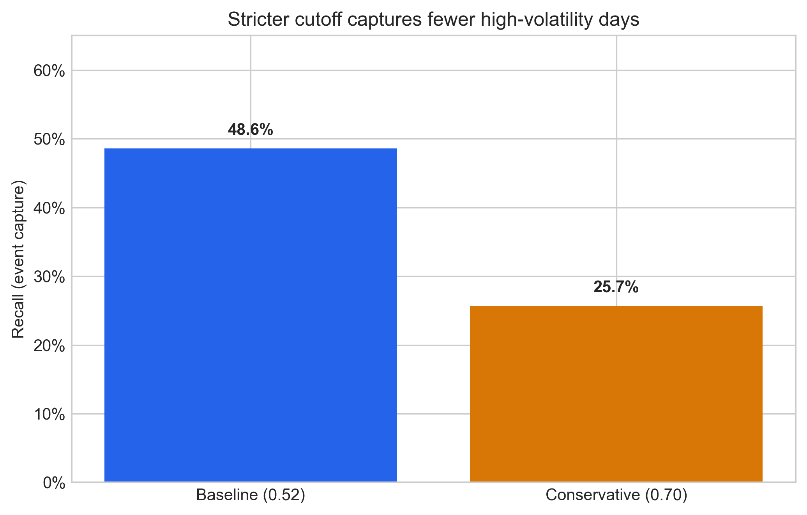
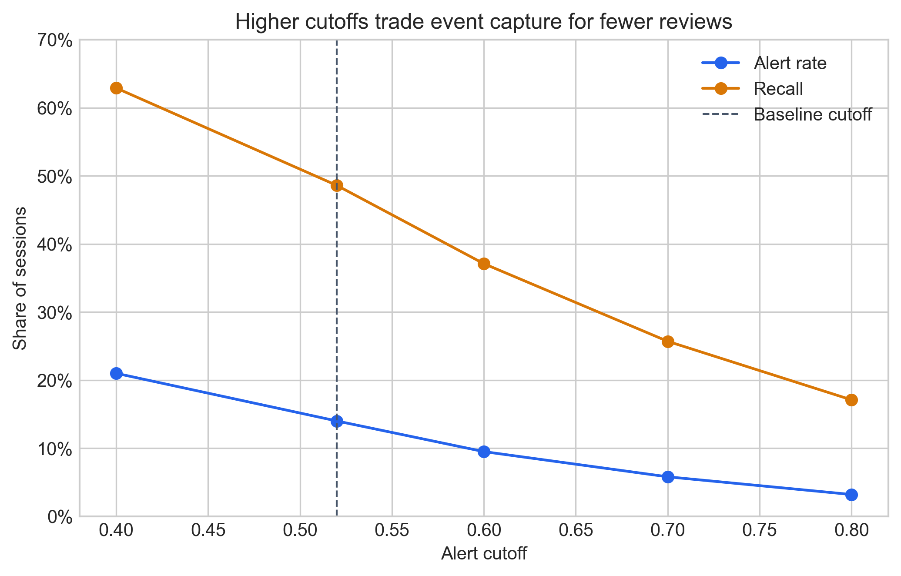
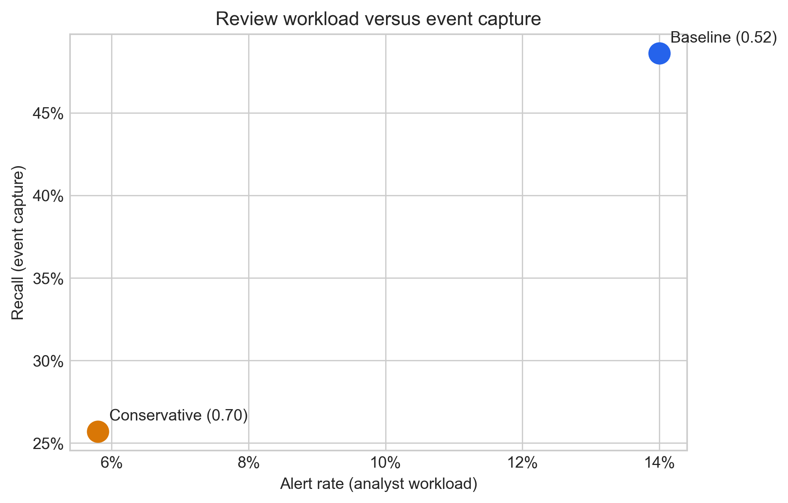

# Final Report: Risk-Alert Delivery Design

## Executive summary

- The baseline review threshold captures 48.6% of high-volatility days while flagging 14.0% of sessions for analyst review.
- Raising the cutoff to 0.70 lowers review workload to 5.8%, but captures only 25.7% of high-volatility days.
- **Decision:** use the baseline as a human review trigger only; do not automate a hedge or trade.

## Audience and decision

This report is for a portfolio risk manager deciding whether to request an additional exposure and hedge review before the next market open. A written report is appropriate because it preserves the trade-offs, assumptions, and decision record for asynchronous review.

## Key visuals

*The baseline catches more relevant events than the conservative scenario. A stricter cutoff reduces the risk manager's coverage.*

*Higher cutoffs reduce the number of review alerts, but reduce event capture at the same time.*

*The two options make the operational trade-off explicit: lower workload entails lower high-volatility-day coverage.*

## Sensitivity summary

| Scenario | Cutoff | Recall | Alert rate | Interpretation |
|---|---:|---:|---:|---|
| Baseline | 0.52 | 48.6% | 14.0% | More review work, better coverage. |
| Conservative | 0.70 | 25.7% | 5.8% | Less review work, more missed events. |

## Assumptions and risks

- The scenario results illustrate a historical risk-alert workflow; they do not establish a causal relationship or a trading edge.
- A cutoff is a business choice. Reducing alerts means accepting more missed high-volatility days.
- Market regimes and data quality can change. Performance should be monitored by regime, along with false negatives and alert volume.

## What this means for you

Keep the baseline threshold when coverage is the priority and use each alert to begin a human review. Adopt the conservative threshold only if lower analyst workload outweighs the additional missed-event risk. Neither scenario supports automatic execution.
