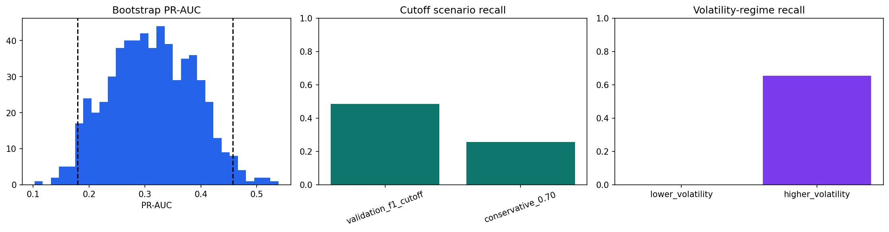

# SPY Next-Day High-Volatility Risk Alert
## Stakeholder Delivery - Portfolio Risk Management

### Executive summary

**Recommendation: use the baseline only as an end-of-day manual review trigger; do not automate a hedge or trade from this signal.**

- On the future-like test period, the alert captured 48.6% of high-volatility days (17 of 35), while creating alerts on 14.0% of sessions.
- The model has limited ranking signal (PR-AUC 0.293; 600-resample interval 0.179 to 0.457), so the estimated value is uncertain.
- Reliability is uneven: recall was 0.0% in the lower-volatility half of the test sample. This is a material reason not to use the score for automatic action.

### Decision context

The portfolio risk manager receives this output after the U.S. close and before the next market open. A high alert should trigger an analyst review of exposures, liquidity, and hedge alternatives. The output is **not** an instruction to trade, a forecast of direction, or a guarantee of loss avoidance.

### Key evidence

*Figure 1. The left panel shows uncertainty around future-test PR-AUC; the middle panel shows the review-workload versus event-capture trade-off at two fixed cutoffs; the right panel exposes the lower-volatility subgroup failure. The figure uses the held-out test predictions and does not retune the model.*

| Future-like test outcome | Value | What it means |
|---|---:|---|
| PR-AUC | 0.293 | Some ranking signal, but modest for a rare-event decision. |
| PR-AUC uncertainty | 0.179 to 0.457 | The precision of the estimate is limited by one test sample. |
| Recall | 48.6% | 51.4% of high-volatility days were missed. |
| Alert rate | 14.0% | Approximate analyst review workload per trading session. |
| Precision | 24.3% | Most alerts will not be high-volatility days; alerts require human context. |

### Alternate scenario: stricter alert cutoff

| Scenario | Cutoff | Recall | Alert rate | High-volatility days captured | Decision implication |
|---|---:|---:|---:|---:|---|
| Validation-selected baseline | 0.52 | 48.6% | 14.0% | 17 | Default manual-review threshold. |
| Conservative scenario | 0.70 | 25.7% | 5.8% | 9 | Fewer reviews, but 8 additional high-volatility days missed. |

Moving from the baseline to the conservative cutoff reduces alert workload by 8.2% of sessions, but lowers recall by 22.9%. This is a deliberate business trade-off, not a performance improvement.

### Assumptions and risks

| Assumption / risk | Plain-language implication | Control or next step |
|---|---|---|
| Training-defined event | A high-volatility day means next-day absolute return exceeds the 90th percentile learned from training history. | Re-estimate only on an approved rolling training schedule; do not use future information. |
| Daily SPY-only inputs | The score excludes portfolio holdings, options, intraday liquidity, and transaction costs. | Treat it as a market-risk screen; add portfolio-aware inputs before any execution use. |
| Regime instability | Market relationships can change, and lower-volatility recall was 0.0% in this test. | Monitor false negatives by regime; suspend escalation if coverage deteriorates. |
| Sample uncertainty | The bootstrap interval is wide and is based on row resampling, which does not fully represent time-series dependence. | Re-test with rolling or block evaluation as more data arrive. |
| Data quality | Provider revisions or missing records can alter the score. | Validate input freshness, schema, and date coverage before publishing an alert. |

### What this means for you

1. **Run daily after close.** If the score exceeds 0.52, ask a risk analyst to review exposures and possible hedge scenarios before the next open.
2. **Do not automate a hedge or trade.** The baseline missed 18 of 35 high-volatility days in the future-like test, including all 9 events in the lower-volatility subgroup.
3. **Monitor before expanding use.** Track alert rate, false negatives, data-quality failures, and performance by volatility regime. Revisit the threshold only after a pre-specified, out-of-sample review.

### Reproducibility and method note

The report is generated from the fixed Stage10 chronological baseline and Stage11 held-out evaluation outputs. Features use information available by the current close; the event threshold is learned from training data only. Supporting details are in [modeling policy](../docs/modeling.md), [evaluation policy](../docs/evaluation.md), and the cumulative [project pipeline](../notebooks/project_pipeline.ipynb).
